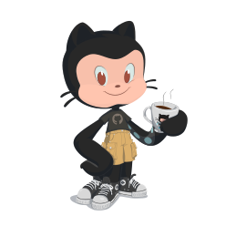

### Hey, I'm Gabriel França! 👋

Passionate about programming and technology. Always looking to create valuable and well-crafted softwares that can help the world in some way. Working remotely, focused on TypesScript, Node.js, ReactJS, NextJS and React Native.

Currently I have been studying ways to quickly and easily write code that is easy to read and maintain, through software architectures, principles and good programming practices.

I love to study, learn and share new things. 

### Find me elsewhere 🌎

<!-- ### Hi there 👋 -->

<!--
**gfgabrielfranca/gfgabrielfranca** is a ✨ _special_ ✨ repository because its `README.md` (this file) appears on your GitHub profile.

Here are some ideas to get you started:

- 🔭 I’m currently working on ...
- 🌱 I’m currently learning ...
- 👯 I’m looking to collaborate on ...
- 🤔 I’m looking for help with ...
- 💬 Ask me about ...
- 📫 How to reach me: ...
- 😄 Pronouns: ...
- ⚡ Fun fact: ...
-->
